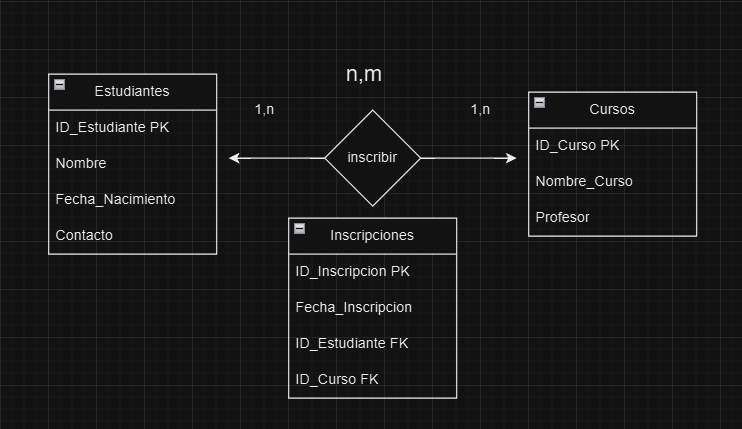

# Ejercicio: Base de Datos para una Escuela, con tabla intermedia

Este ejercicio consiste en diseñar una base de datos para una **escuela** que
gestione información sobre estudiantes, cursos, y las inscripciones de los
estudiantes en dichos cursos y la introducción a las tablas intermedias.

## Índice

- [Crear un diagrama conceptual](#paso-1-definir-las-entidades-y-atributos)
- [Ejemplo Visual del Diagrama Conceptual](#ejemplo-visual-del-diagrama-conceptual)
- [Explicación de la Tabla Intermedia](#explicación-de-la-tabla-intermedia)
- [Crear la Base de Datos SQL, Tablas y manipulación](#paso-1-crear-la-base-de-datos-y-seleccionar-su-uso)
- [Resumen de Comandos Basicos](#resumen-de-comandos-básicos)

## Requerimientos

1. **Estudiantes**: Cada estudiante tiene un identificador único, nombre, fecha
   de nacimiento, y un número de contacto.
2. **Cursos**: Cada curso tiene un identificador único, nombre del curso, y el
   nombre del profesor a cargo.
3. **Inscripciones**: Queremos registrar cada vez que un estudiante se inscribe
   en un curso específico. La inscripción también debe tener la fecha de
   inscripción.

## Paso 1: Definir las Entidades y Atributos

1. **Entidades**:

   - **Estudiantes**: Representa a los estudiantes de la escuela.
   - **Cursos**: Representa los cursos que ofrece la escuela.
   - **Inscripciones**: Registra las inscripciones de los estudiantes en los
     cursos.

2. **Atributos**:
   - **Estudiantes**:
     - `ID_Estudiante` (Primary Key)
     - `Nombre`
     - `Fecha_Nacimiento`
     - `Contacto`
   - **Cursos**:
     - `ID_Curso` (Primary Key)
     - `Nombre_Curso`
     - `Profesor`
   - **Inscripciones**:
     - `ID_Inscripcion` (Primary Key)
     - `Fecha_Inscripcion`
     - `ID_Estudiante` (Foreign Key hacia `Estudiantes`)
     - `ID_Curso` (Foreign Key hacia `Cursos`)

## Paso 2: Relaciones entre Entidades

- **Estudiantes y Cursos**:
  - Un estudiante puede inscribirse en varios cursos y cada curso puede tener
    varios estudiantes inscritos.
  - **Relación**: Muchos a muchos (**N:M**).
  - **Solución**: La relación de muchos a muchos se resuelve creando una **tabla
    intermedia** llamada `Inscripciones`, que contiene claves foráneas a
    `Estudiantes` y `Cursos`, además de la fecha de inscripción.

## Paso 3: Crear el Diagrama Conceptual

Para el diagrama conceptual, representa cada entidad como un rectángulo y
utiliza líneas para conectar las relaciones entre las entidades, indicando la
cardinalidad.

1. **Entidades**: Dibuja un rectángulo para cada una de las entidades
   (`Estudiantes`, `Cursos`, `Inscripciones`).
2. **Relaciones**:
   - Conecta `Estudiantes` y `Cursos` a la tabla `Inscripciones`, que actúa como
     la relación **N:M** entre ellos.
3. **Atributos**: Incluye los atributos en cada entidad y señala las claves
   primarias y foráneas.

## Ejemplo Visual del Diagrama Conceptual

Aquí tienes una visualización del diagrama conceptual para ayudarte a entender
cómo organizar las entidades, relaciones y cardinalidades.

      Estudiantes (1) ------------------ (N) Inscripciones (N) ------------------ (1) Cursos
     +--------------+                   +---------------------+                  +--------------+
     |ID_Estudiante |                   |ID_Inscripcion      |                  |ID_Curso      |
     |Nombre        |                   |Fecha_Inscripcion   |                  |Nombre_Curso  |
     |Fecha_Nacimiento|                 |ID_Estudiante (FK)  |                  |Profesor      |
     |Contacto      |                   |ID_Curso (FK)       |                  +--------------+
     +--------------+                   +---------------------+

- **`Estudiantes`** se conecta con **`Inscripciones`** (relación 1:N).
- **`Cursos`** también se conecta con **`Inscripciones`** (relación 1:N).

En este modelo, `Inscripciones` se encarga de gestionar la relación de muchos a
muchos entre `Estudiantes` y `Cursos`, permitiendo que varios estudiantes se
inscriban en varios cursos.

## Diagrama conceptual



## Explicación de la Tabla Intermedia

### ¿Qué es una Tabla Intermedia?

Una **tabla intermedia** (o tabla de unión) es una tabla que se utiliza para
**gestionar una relación muchos a muchos (N:M)** entre dos tablas en una base de
datos.

### ¿Por qué Necesitamos una Tabla Intermedia?

Imagina que tienes dos tablas: **Estudiantes** y **Cursos**. La relación entre
ellas es de **muchos a muchos (N:M)** porque:

- Un **estudiante** puede inscribirse en **varios cursos**.
- Un **curso** puede tener **varios estudiantes inscritos**.

Las bases de datos relacionales, como MySQL, no permiten relacionar directamente
dos tablas en una relación muchos a muchos. Aquí es donde entra en juego la
**tabla intermedia**.

### Ejemplo de Tabla Intermedia

Para el caso de **Estudiantes** y **Cursos**, la tabla intermedia se llama
**Inscripciones**. Esta tabla tiene:

1. **Claves foráneas** a las tablas que conecta (`ID_Estudiante` y `ID_Curso`).
2. **Atributos adicionales** si es necesario, como la `Fecha_Inscripcion` para
   registrar cuándo el estudiante se inscribió en el curso, y su propia
   `ID_Inscripcion`

La estructura de la tabla `Inscripciones` sería:

| ID_Inscripcion | ID_Estudiante (FK) | ID_Curso (FK) | Fecha_Inscripcion |
| -------------- | ------------------ | ------------- | ----------------- |
| 1              | 101                | 201           | 2024-11-09        |
| 2              | 102                | 201           | 2024-11-10        |
| 3              | 101                | 202           | 2024-11-10        |

### Cómo Funciona la Tabla Intermedia

La tabla `Inscripciones` permite:

- **Registrar cada inscripción**: Cada fila representa una inscripción de un
  estudiante en un curso específico.
- **Administrar la relación muchos a muchos**: Permite que múltiples estudiantes
  se relacionen con múltiples cursos.
- **Añadir información adicional**: Podemos guardar datos específicos de la
  inscripción, como `Fecha_Inscripcion`.

### Resumen

- Una **tabla intermedia** sirve para gestionar relaciones muchos a muchos entre
  dos tablas.
- **Contiene claves foráneas** que enlazan con las dos tablas principales y
  permite **almacenar información adicional** de la relación si es necesario.
- Es **esencial** para manejar relaciones complejas de manera organizada y
  eficiente en bases de datos relacionales.

## Guía de Comandos SQL para Crear y Manipular una Base de Datos en MySQL

### Paso 1: Crear la Base de Datos y Seleccionar su Uso

#### Comando: `CREATE DATABASE` y `USE`

- **`CREATE DATABASE`**: Crea una nueva base de datos con el nombre
  especificado.
- **`USE`**: Selecciona la base de datos para que todos los comandos que
  escribas después se apliquen a ella.

```sql
CREATE DATABASE Escuela; -- Crea una base de datos llamada 'Escuela'
USE Escuela;             -- Selecciona la base de datos 'Escuela' para su uso
```

### Paso 2: Crear las Tablas

En este paso, crearemos las tablas `Estudiantes`, `Cursos`, y `Inscripciones`
dentro de la base de datos seleccionada.

#### Comando: `CREATE TABLE`

- **`CREATE TABLE`**: Crea una tabla con el nombre y estructura especificada.
- **`AUTO_INCREMENT`**: Hace que el valor de un campo se incremente
  automáticamente con cada nuevo registro, útil para claves primarias.
- **`PRIMARY KEY`**: Define una columna como clave primaria, identificando de
  manera única cada registro en la tabla.
- **`FOREIGN KEY`**: Crea una relación entre esta tabla y otra, asegurando que
  los valores en una columna coincidan con los valores en la columna de clave
  primaria de otra tabla.

#### Tabla `Estudiastes`:

```sql
CREATE TABLE Estudiantes (
    ID_Estudiante INT PRIMARY KEY AUTO_INCREMENT, -- Identificador único y clave primaria
    Nombre VARCHAR(50) NOT NULL,                  -- Nombre del estudiante
    Fecha_Nacimiento DATE,                        -- Fecha de nacimiento del estudiante
    Contacto VARCHAR(20)                          -- Número de contacto del estudiante
);
```

- **ID_Estudiante**: Clave primaria que se incrementa automáticamente.
- **Nombre**: Obligatorio (`NOT NULL`) para asegurar que cada estudiante tenga
  un nombre.
- **Fecha_Nacimiento** y **Contacto**: Información adicional opcional.

#### Tabla `Cursos`:

```sql
CREATE TABLE Cursos (
    ID_Curso INT PRIMARY KEY AUTO_INCREMENT, -- Identificador único y clave primaria
    Nombre_Curso VARCHAR(50) NOT NULL,       -- Nombre del curso
    Profesor VARCHAR(50)                     -- Nombre del profesor a cargo del curso
);
```

- **ID_Curso**: Clave primaria con incremento automático.
- **Nombre_Curso**: Obligatorio, asegura que cada curso tenga un nombre.
- **Profesor**: Nombre del profesor que imparte el curso.

#### Tabla Intermedia `Inscripciones`.

La tabla `Inscripciones` sirve para gestionar la relación muchos a muchos entre
`Estudiantes` y `Cursos`.

```sql
CREATE TABLE Inscripciones (
    ID_Inscripcion INT PRIMARY KEY AUTO_INCREMENT, -- Clave primaria con incremento automático
    Fecha_Inscripcion DATE,                        -- Fecha en que el estudiante se inscribió en el curso
    ID_Estudiante INT,                             -- Clave foránea hacia Estudiantes
    ID_Curso INT,                                  -- Clave foránea hacia Cursos
    FOREIGN KEY (ID_Estudiante) REFERENCES Estudiantes(ID_Estudiante),
    FOREIGN KEY (ID_Curso) REFERENCES Cursos(ID_Curso)
);
```

- **ID_Inscripcion**: Clave primaria con incremento automático.
- **Fecha_Inscripcion**: Fecha de inscripción en el curso.
- **ID_Estudiante** y **ID_Curso**: Claves foráneas que se relacionan con las
  claves primarias de `Estudiantes` y `Cursos`, respectivamente.

### Paso 3: Insertar Datos en las Tablas

Para llenar las tablas con datos, usamos el comando `INSERT INTO`.

#### Comando: `INSERT INTO`

- **`INSERT INTO`**: Inserta datos en una tabla específica.
- **`VALUES`**: Especifica los valores que queremos insertar en las columnas de
  la tabla.

#### Insertar Datos en la Tabla `Estudiantes`

```sql
INSERT INTO Estudiantes (Nombre, Fecha_Nacimiento, Contacto) VALUES
('Juan Perez', '2003-05-21', '555-1234'),
('Ana Lopez', '2002-08-15', '555-5678'),
('Carlos Jimenez', '2004-11-03', '555-9876');
```

Inserta varios registros en una sola sentencia. Cada conjunto de valores entre
paréntesis corresponde a una fila.

#### Insertar Datos en la Tabla `Cursos`

```sql
INSERT INTO Cursos (Nombre_Curso, Profesor) VALUES
('Matemáticas', 'Prof. Gómez'),
('Historia', 'Prof. Santos'),
('Biología', 'Prof. Martinez');
```

Al igual que en Estudiantes, insertamos varios registros a la vez.

#### Insertar Datos en la Tabla Intermedia `Inscripciones`

```sql
INSERT INTO Inscripciones (Fecha_Inscripcion, ID_Estudiante, ID_Curso) VALUES
('2024-01-15', 1, 1),
('2024-02-12', 2, 2),
('2024-03-14', 3, 3);
```

Usamos `ID_Estudiante` y `ID_Curso` para vincular cada inscripción con un
estudiante y un curso específicos.

### Paso 4: Consultar y Manipular Datos

Una vez que los datos están en la base de datos, puedes consultar y manipular la
información.

#### Comando: `SELECT` para Consultar Datos

- **`SELECT`**: Recupera datos de una o varias tablas.
- **`JOIN`**: Combina datos de varias tablas en función de una columna
  relacionada.

#### Ver todos los registros de `Estudiantes`

```sql
SELECT * FROM Estudiantes;
```

Recupera todas las columnas y filas de la tabla `Estudiantes`.

#### Consultar Inscripciones con Nombres de Estudiantes y Cursos

Esta consulta usa `JOIN` para combinar información de `Inscripciones`,
`Estudiantes`, y `Cursos`.

```sql
SELECT
    Inscripciones.ID_Inscripcion,
    Estudiantes.Nombre AS Estudiante,
    Cursos.Nombre_Curso AS Curso,
    Inscripciones.Fecha_Inscripcion
FROM Inscripciones
JOIN Estudiantes ON Inscripciones.ID_Estudiante = Estudiantes.ID_Estudiante
JOIN Cursos ON Inscripciones.ID_Curso = Cursos.ID_Curso;
```

- `AS`: Renombra las columnas para mayor claridad en los resultados.
- Esta consulta muestra el nombre del estudiante, el curso en el que se
  inscribió, y la fecha de inscripción.

#### Comando: `UPDATE` para Modificar Datos

- `UPDATE`: Modifica los valores de una tabla existente.
- `SET`: Especifica las columnas y sus nuevos valores.
- `WHERE`: Define las condiciones para elegir las filas a actualizar.

#### Cambiar el Nombre de un Estudiante

```sql
UPDATE Estudiantes
SET Nombre = 'Juan Pérez Gómez'
WHERE ID_Estudiante = 1;
```

Actualiza el nombre del estudiante con `ID_Estudiante` = 1 a "Juan Pérez Gómez".

#### Comando: `DELETE` para Eliminar Datos

- `DELETE`: Elimina filas de una tabla.
- `WHERE`: Especifica las condiciones para las filas que se eliminarán.

#### Eliminar una Inscripción

```sql
DELETE FROM Inscripciones
WHERE ID_Inscripcion = 3;
```

### Resumen de Comandos Básicos

| Acción              | Comando SQL                                           |
| ------------------- | ----------------------------------------------------- |
| Crear base de datos | `CREATE DATABASE nombre;`                             |
| Usar base de datos  | `USE nombre;`                                         |
| Crear tabla         | `CREATE TABLE nombre (...);`                          |
| Insertar datos      | `INSERT INTO tabla (col1, col2) VALUES (val1, val2);` |
| Consultar datos     | `SELECT * FROM tabla;`                                |
| Consultar con JOIN  | `SELECT ... FROM tabla1 JOIN tabla2 ON ...;`          |
| Actualizar datos    | `UPDATE tabla SET columna = valor WHERE ...;`         |
| Eliminar datos      | `DELETE FROM tabla WHERE ...;`                        |
