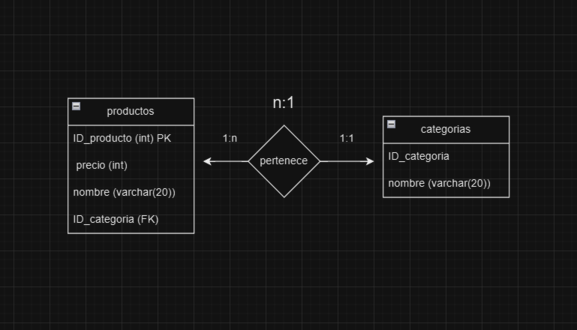

# Ejercicio: Base de Datos para una Tienda de Ropa

Imagina que necesitas diseñar una base de datos para una tienda de ropa que
gestione la información de sus productos y categorías. Queremos almacenar los
datos más esenciales sobre los artículos que vende y organizarlos por
categorías.

## Paso 1: Requerimientos

1. **Productos**: Cada producto debe tener un identificador único, nombre,
   precio, y la categoría a la que pertenece.
2. **Categorías**: Cada categoría de productos debe tener un identificador único
   y un nombre descriptivo (por ejemplo, "Camisas", "Pantalones", "Accesorios",
   etc.).

## Paso 2: Definir Entidades y Atributos

1. **Entidades**:

   - **Productos**: Representa los artículos que se venden en la tienda.
   - **Categorías**: Representa las distintas categorías de los productos.

2. **Atributos**:
   - **Productos**:
     - `ID_Producto` (Primary Key)
     - `Nombre` (nombre del producto)
     - `Precio`
     - `ID_Categoria` (Foreign Key, indica la categoría a la que pertenece el
       producto)
   - **Categorías**:
     - `ID_Categoria` (Primary Key)
     - `Nombre` (nombre de la categoría, como "Camisas", "Pantalones", etc.)

## Paso 3: Relación entre Entidades

- **Relación 1:N** entre `Categorías` y `Productos`:
  - Una **categoría** puede tener varios **productos**.
  - Cada **producto** pertenece a una sola **categoría**.

### Diagrama conceptual

