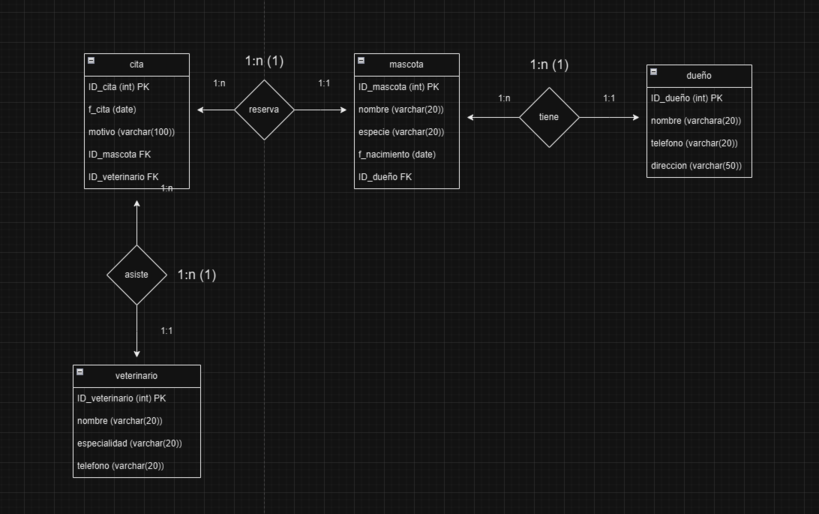

# Base de Datos para una Clínica Veterinaria

Imagina que estás diseñando una base de datos para una **clínica veterinaria**.
Queremos almacenar información sobre los dueños de las mascotas, las mascotas,
las citas, y los veterinarios que atienden cada consulta.

## Paso 1: Requerimientos

1. **Dueños**: Cada dueño de mascota debe tener un identificador único, nombre,
   teléfono y dirección.
2. **Mascotas**: Cada mascota debe tener un identificador único, nombre, especie
   (perro, gato, etc.), fecha de nacimiento y el identificador del dueño.
3. **Citas**: Queremos registrar cada cita con un identificador único, fecha de
   la cita, motivo de la consulta, y el identificador de la mascota.
4. **Veterinarios**: Cada veterinario debe tener un identificador único, nombre,
   especialidad, y número de teléfono.

## Paso 2: Definir las Entidades y Atributos

1. **Entidades**:

   - **Dueños**: Representa a los dueños de las mascotas.
   - **Mascotas**: Representa a las mascotas registradas en la clínica.
   - **Citas**: Representa las consultas o visitas de las mascotas a la clínica.
   - **Veterinarios**: Representa a los veterinarios que atienden en la clínica.

2. **Atributos**:
   - **Dueños**:
     - `ID_Dueno` (Primary Key)
     - `Nombre`
     - `Telefono`
     - `Direccion`
   - **Mascotas**:
     - `ID_Mascota` (Primary Key)
     - `Nombre`
     - `Especie`
     - `Fecha_Nacimiento`
     - `ID_Dueno` (Foreign Key hacia `Dueños`)
   - **Citas**:
     - `ID_Cita` (Primary Key)
     - `Fecha_Cita`
     - `Motivo`
     - `ID_Mascota` (Foreign Key hacia `Mascotas`)
     - `ID_Veterinario` (Foreign Key hacia `Veterinarios`)
   - **Veterinarios**:
     - `ID_Veterinario` (Primary Key)
     - `Nombre`
     - `Especialidad`
     - `Telefono`

## Paso 3: Relaciones entre Entidades

- **Dueños y Mascotas**: Un dueño puede tener varias mascotas, pero cada mascota
  tiene un solo dueño. Relación **1:N** entre `Dueños` y `Mascotas`.
- **Mascotas y Citas**: Una mascota puede tener varias citas, pero cada cita
  está asociada a una sola mascota. Relación **1:N** entre `Mascotas` y `Citas`.
- **Veterinarios y Citas**: Un veterinario puede atender varias citas, pero cada
  cita es atendida por un solo veterinario. Relación **1:N** entre
  `Veterinarios` y `Citas`.

## Paso 4: Crear el Diagrama Conceptual

Para el diagrama conceptual, representa cada entidad como un rectángulo y
utiliza líneas para conectar las relaciones entre las entidades, indicando la
cardinalidad.

1. **Entidades**: Dibuja un rectángulo para cada una de las entidades (`Dueños`,
   `Mascotas`, `Citas`, `Veterinarios`).
2. **Relaciones**: Conecta las entidades según las relaciones explicadas,
   utilizando las notaciones de 1:N donde corresponda.
3. **Atributos**: Añade los atributos dentro de cada rectángulo, marcando las
   claves primarias y foráneas.

## Ejemplo de cómo se vería el Diagrama Conceptual

Aquí tienes una estructura base para ayudarte a visualizar el diagrama:

      Dueños (1) ---------------------- (N) Mascotas
     +-----------+                   +----------------+
     |ID_Dueno   |                   |ID_Mascota      |
     |Nombre     |                   |Nombre          |
     |Telefono   |                   |Especie         |
     |Direccion  |                   |Fecha_Nacimiento|
     +-----------+                   |ID_Dueno (FK)   |
                                     +----------------+
                                             |
                                             |
       Veterinarios (1) ------------------- (N) Citas
     +-----------+                   +----------------+
     |ID_Veterinario |               |ID_Cita         |
     |Nombre         |               |Fecha_Cita      |
     |Especialidad   |               |Motivo          |
     |Telefono       |               |ID_Mascota (FK) |
     +-----------+                   |ID_Veterinario (FK)|
                                     +----------------+

## Consejos para Representar el Diagrama

- Usa **rectángulos** para cada entidad y coloca dentro los atributos,
  destacando las claves primarias (por ejemplo, subrayando).
- Conecta las entidades con **líneas** y agrega la cardinalidad en el extremo de
  cada línea (1, N, etc.).
- Usa las **claves foráneas** para indicar la relación en una entidad. Por
  ejemplo, `ID_Dueno` en `Mascotas` representa la relación con `Dueños`.

🔗 Para crear la BD, dejate guiar por los pasos en
[veterinaria_DB.sql](veterinaria_DB.sql)

## Mi resultado del ejercicio: Diagrama conceptual

